# Introducción al Análisis de Redes Sociales

Curso impartido por:

🖊 [Alejandro Espinosa-Rada](https://github.com/anespinosa)

-   [](https://twitter.com/aespinosarada)
-   🏫 [Social Networks Lab](https://sn.ethz.ch), ETH Zürich

🖊 [Francisca
Ortiz](https://www.research.manchester.ac.uk/portal/francisca.ortiz.html)

-   [](https://twitter.com/FranciscaOrtizR)
-   🏫 [The Mitchell Centre for Social Network
    Analysis](https://www.socialsciences.manchester.ac.uk/mitchell-centre/),
    The University of Manchester
-   🏫 [Millennium Institute for Caregiving Research
    (MICARE)](https://www.micare.cl)

## Directorio de trabajo

``` r
setwd()
```

``` r
rm(list=ls())
```

En este workshop trabajaremos con tres paquetes escritos en R:

-   [`igraph`](https://igraph.org/r/): uno de los paquetes más
    utilizados para analizar redes en R.
-   [`classicnets`](https://github.com/anespinosa/classicnets):
    repositorio con datos de redes sociales clásicas
-   [`netmem`](https://github.com/anespinosa/netmem): paquete (en
    proceso de construcción) que utiliza matrices para el análisis de
    redes

## Redes

Para este tutorial se utilizán dos bases de datos. La primera fue
recolectada por Freeman y Freeman (1979, 1980) (contexto sobre la
relevancia de esta red en el desarrollo del análisis de redes en
[Freeman
2005](https://www.researchgate.net/publication/239228599_The_Development_of_Social_Network_Analysis))
y otra red más contemporánea recolectada por Rossi y Magnani (
[2018](https://arxiv.org/pdf/1501.01666.pdf))

Muchísimas gracias a [Ulrik
Brandes](https://sn.ethz.ch/profile.html?persid=239462) por proveer
parte de la información y documentación de la base de datos de EIES!

``` r
#### FREEMAN AND FREEMAN ####
# install.packages("devtools")
# library(devtools)
# devtools::install_github("anespinosa/classicnets")
library(classicnets)
data("eies")
?eies

#### ROSSI AND MAGNANI ####
# install.packages("igraph")
library(igraph)
load('gaucs.Rda')
```

## Empleados del Departamento de Ciencias de la Computaci’on de la Universidad de Aarhus en Dinamarca

Red no direccionada (i.e., relación de trabajo actual)

``` r
matrix <- get.adjacency(gaucs$work, sparse = FALSE)
dim(matrix)
head(matrix)
matrix[1,] # emisor
matrix[,1] # receptor
table(matrix[1,] == matrix[,1]) # Ejercicio: Por qué ambos son TRUE? 

ncol(matrix) # número de nodos
sum(matrix)/2 # número de aristas

vcount(gaucs$work) == ncol(matrix)
ecount(gaucs$work) == sum(matrix)/2 # Ejercicio: Por qué la matrix se divide por dos?

edgelist <- matrix_to_edgelist(matrix, digraph = FALSE)
```

Ego-redes

``` r
plot(gaucs$work)
```

<!-- -->

``` r
# Una pequeña función para extraer los vecinos de ego sin considerar a ego!
ego_net <- function(A, actor=NULL){
  A <- as.matrix(A)
  actor <- as.character(actor)
  if(is.null(rownames(A))){
    rownames(A) <- paste(1:nrow(A))
  }
  if(is.null(rownames(A))){
    colnames(A) <- paste(1:ncol(A))
  }
  nameOut <- names(which(A[actor,]!=0))
  nameIn <- names(which(A[,actor]!=0))
  name <- unique(c(nameOut, nameIn))
  return(A[name, name])
}

# Elegir un actor de forma aleatoria!
actor <- sample(V(gaucs$work)$name, 1) 
ego_net(matrix, actor = actor)

# Cuántos vecinos tiene el actor U6?
ego_net(matrix, actor = 'U6')

# Incluyendo a ego y suponiendo que estamos interesados/as en el actor 'U4'
egoU6 <- igraph::ego(gaucs$work, 
                     order=1, 
                     # John Barnes (Escuela de Redes de Manchester)
                     # denominaba esto 'zonas' de ego, 
                     # en donde 0 es ego y 1 son sus alteris
                     nodes= 'U4', # nodo de interés
                     mode = 'all' # considerando tanto emisores como receptores 
                     )
egoU6 <- igraph::induced_subgraph(gaucs$work, unlist(egoU6))
plot(egoU6)
```

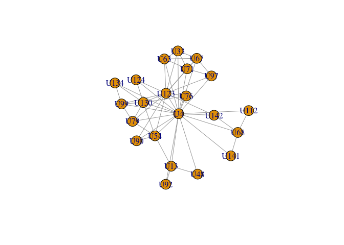<!-- -->

``` r
# Ejercicio: Cuál es la diferencia entre 'ego_net' y 'induced_sugraph' de igraph para este ejemplo?
```

Densidad

``` r
(sum(matrix))/((ncol(matrix)*(ncol(matrix)-1)))
```

Grados nodales

``` r
# Grados nodales de cada actor
rowSums(matrix)

# Distribución de grados nodales
plot(table(rowSums(matrix))) # Efecto Mateo? (Merton, 1968)
```

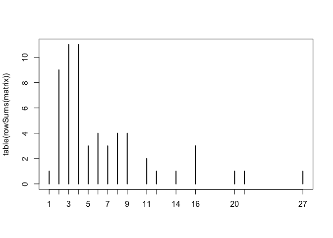<!-- -->

``` r
# Promedio de grados
mean(rowSums(matrix)); sum(rowSums(matrix))/ncol(matrix)
```

Considerando la teoría de los agujeros estructurales de Ronald Burt
([1995](https://books.google.ch/books?id=E6v0cVy8hVIC&printsec=frontcover&source=gbs_ge_summary_r&cad=0#v=onepage&q&f=false)):

``` r
egoU4 <- ego_net(matrix, actor = 'U4')
redundancy <- mean(rowSums(egoU4))
effective_size <- ncol(egoU4) - redundancy
(efficiency <- effective_size/ncol(egoU4)) # Qué tan redundantes es la red de U4?
```

Para calcular constreñimiento utilizaremos un paquete alternativo con
ligeras modificaciones siguiento el trabajo realizado por Martin Everett
y Steve Borgatti ([2020](https://doi.org/10.1016/j.socnet.2020.02.001))

``` r
# install.packages("devtools")
# devtools::install_github("anespinosa/netmem")

library(netmem)
```

    ## 
    ## Attaching package: 'netmem'

    ## The following object is masked _by_ '.GlobalEnv':
    ## 
    ##     ego_net

    ## The following object is masked from 'package:classicnets':
    ## 
    ##     matrix_to_edgelist

``` r
addegoU4 <- rbind(egoU4, U4=rep(1, nrow(egoU4)))
addegoU4 <- cbind(addegoU4, U4=rep(1, nrow(addegoU4)))
diag(addegoU4) <- 0
eb_constraint(addegoU4,
              ego="U4")
```

## Intercambio de Investigadores de Redes Sociales a través del Electronic Information Exchange System (EIES) en Estados Unidos

Red que considera direcciones de los lazos emitidos (i.e., a quiénes
considera como amigos/as)

``` r
# Matriz de adjacencia
matrix <- ifelse(eies$time1 > 2, 1, 0)
dim(matrix)
head(matrix)
matrix[1,] # Emisor
matrix[,1] # Receptor

ncol(matrix) # número de nodos
sum(matrix) # número de aristas

# Lista de relaciones
edgelist <- matrix_to_edgelist(matrix, digraph = TRUE)
```

Densidad

``` r
sum(matrix)/(ncol(matrix)*(ncol(matrix)-1))

library(netmem)
gen_density(matrix, directed = TRUE)
# igraph::graph.density(igraph::graph.adjacency(simple_net, mode=c("directed")))
# sna::gden(network::network(matrix), mode="digraph")
```

Grados de salida y grados de entrada (i.e., *outdegree* e *indegree*
centrality)

``` r
rowSums(matrix)
colSums(matrix)

# Distribuciones de grados nodales
plot(table(rowSums(matrix)))
```

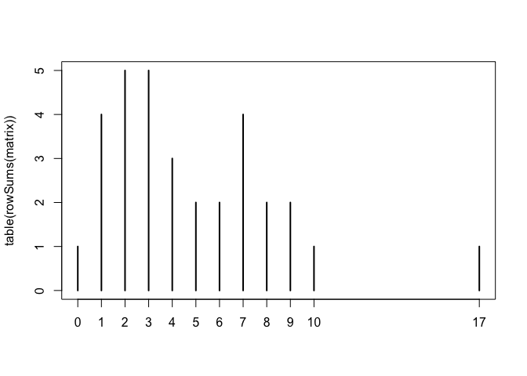<!-- -->

``` r
plot(table(colSums(matrix)))
```

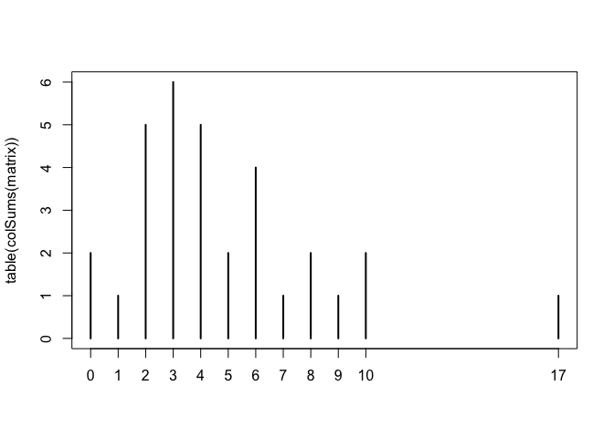<!-- -->

Reciprocidad en la red

``` r
((1/2)*sum(diag(matrix%*%matrix)))/sum(matrix)
# Es la mutualidad alta en esta red?
```

Ego-redes, en donde exploraremos las redes de algunos de estos
investigadores, tales como:

-   [Linton
    Freeman](https://www.exeley.com/connections/doi/10.21307/connections-2018-003):
    sociólogo matemático que ayudó a institucionalizar la perspectiva de
    redes como un área de especialización (ejemplo: [Freeman
    2005](https://www.researchgate.net/publication/239228599_The_Development_of_Social_Network_Analysis))
    y contribuyó extensamente en el análisis de redes sociales.
-   [Everett Rogers](https://en.wikipedia.org/wiki/Everett_Rogers):
    conocido por temas relacionados con *difusión de innovaciones*.
-   [Nicholas
    Mullins](https://link.springer.com/content/pdf/10.1007/BF01881390.pdf):
    trabajó generando el primer modelo relacional sobre la evolución de
    *especializaciones científicas* y en la teorización relacional sobre
    la *formación de grupos*.
-   [Mark
    Granovetter](https://sociology.stanford.edu/people/mark-granovetter):
    ampliamente conocido por su artículo sobre la *fuerza de los
    vínculos débiles* y en sus contribuciones en áreas relacionadas con
    sociología económica (entrevistado recientemente el podcast biligüe
    [Knitting Netowkrs/Tejiendo
    Redes](https://open.spotify.com/episode/0vx0VHvUN1btyoFHcVlvNi))

``` r
set.seed(12354)
rownames(matrix) <- eies$label
colnames(matrix) <- eies$label
plot(graph.adjacency(matrix, mode = c('directed')),
     edge.arrow.size=0.3, vertex.size=5, vertex.label=NA)
```

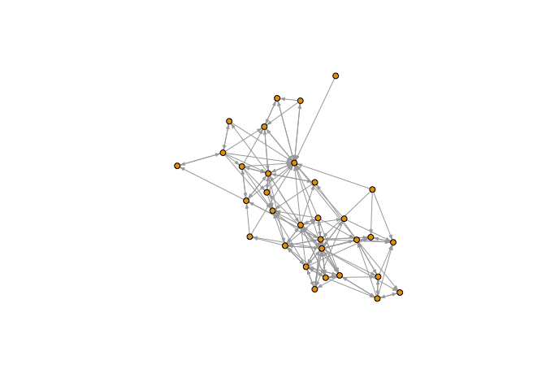<!-- -->

``` r
# Elegir un actor de forma aleatoria!
actor <- sample(eies$label, 1) 
ego_net(matrix, actor = actor)

# Explorando algunas redes!
plot(graph.adjacency(ego_net(matrix, actor = 'Lin Freeman'),
                  mode = c('directed')),
     edge.arrow.size=0.3,vertex.size=5,
     main = "Ego-red de Linton Freeman")
```

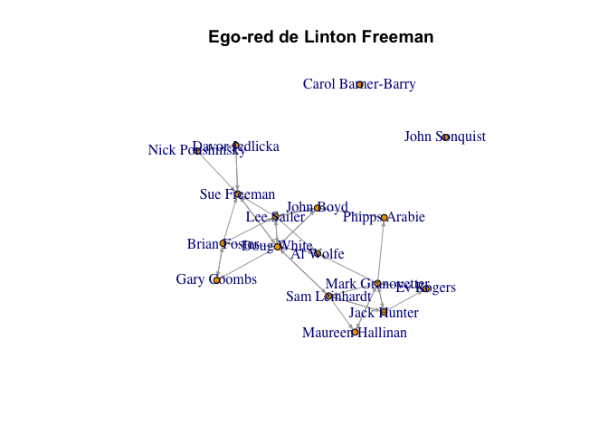<!-- -->

``` r
plot(graph.adjacency(ego_net(matrix, actor = 'Ev Rogers'),
                  mode = c('directed')),
     edge.arrow.size=0.3,vertex.size=5,
     main = "Ego-red de Everett Rogers")
```

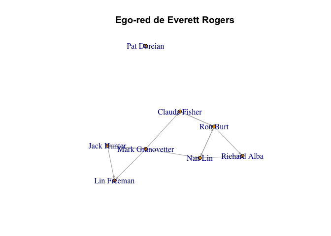<!-- -->

``` r
plot(graph.adjacency(ego_net(matrix, actor = 'Nick Mullins'),
                  mode = c('directed')),
     edge.arrow.size=0.3,vertex.size=5,
     main = "Ego-red de Nicholas Mullins")
```

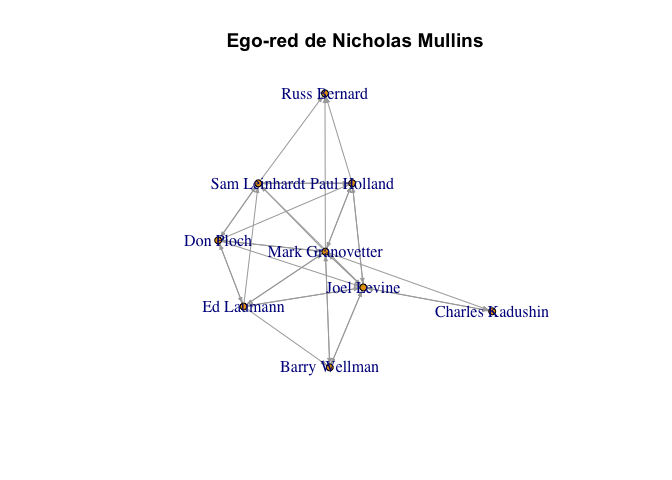<!-- -->

``` r
plot(graph.adjacency(ego_net(matrix, actor = 'Mark Granovetter'),
                  mode = c('directed')),
     edge.arrow.size=0.3,vertex.size=5,
     main = "Ego-red de Mark Granovetter")
```

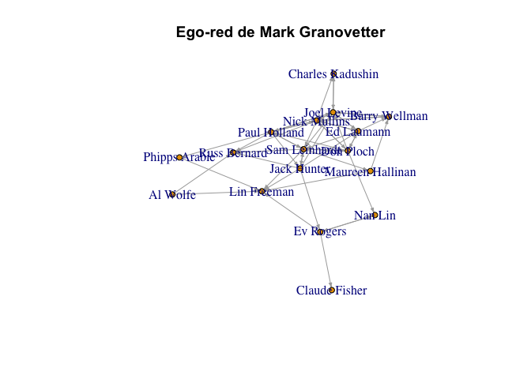<!-- -->

Cuántos vinculos tienen los investigadores de la red EIES que adscriben
a la misma disciplina y cuántos vínculos hay entre actores de distintas
disciplinas?

``` r
# Matriz mixta
mixMatrix <- function(A, att=NULL){
  if(is.null(att))stop("No attribute has been specified")
  data <- as.data.frame(cbind(label=colnames(A), att=att))
  edgelist <- classicnets::matrix_to_edgelist(A)
  
  edgeFROM <- as.data.frame(edgelist[,1L])
  colnames(edgeFROM) <- 'label'
  edgeFROM$id <- 1:nrow(edgeFROM)
  edgeFROM <- merge(edgeFROM, data, by = "label")
  edgeFROM <- edgeFROM[order(edgeFROM$id),] 

  edgeTO <- as.data.frame(edgelist[,2L])
  colnames(edgeTO) <- 'label'
  edgeTO$id <- 1:nrow(edgeTO)
  edgeTO <- merge(edgeTO, data, by = "label")
  edgeTO <- edgeTO[order(edgeTO$id),] 

  mixMATRIX <- do.call(table, c(list(From=edgeFROM$att, 
                                     To=edgeTO$att)))
  
   if(all(A[lower.tri(A)] == t(A)[lower.tri(A)])){
     warning("The network is undirected")
    mixMATRIX <- mixMATRIX + t(mixMATRIX)
    diag(mixMATRIX) <- diag(mixMATRIX)%/%2L 
   }
  return(mixMATRIX)
}
mixMatrix(matrix, att=eies$discipline)

# Cómo interpretamos esta tabla? 
# Para ver el detalle de la base: ?eies
```

El índice E-I ([Krackhardt y Stern
1988](https://doi.org/10.2307/2786835))

``` r
ei.table <- function(matrix, mixed=TRUE, att=NULL)
{
  if(!mixed){
    matrix <- mixMatrix(matrix, att)
  }
  if(length(dim(matrix)) == 3)
    m <- matrix[,,2]
  else m <- matrix
  pI <- m / sum(m)
  I <- sum(diag(pI))
  diag(pI) <- 0
  E <- sum(pI)
  EIindex <- E - I
  return( E - I )
}
ei.table(matrix, mixed=FALSE, att=eies$discipline) # Hay homofilia en la red?

# Los investigadores tienen atributos similares entre sí?
sim <- abs(outer(eies$discipline,eies$discipline,"=="))
diag(sim) <- 0

# Los lazos que envían los autores son ellos mismos homófilas?
homophily <- ifelse(matrix&sim==1, 1, 0)
homophily[1,] # explorando los datos...
rowSums(homophily) # número de lazos emitidos que son homófilos
rowSums(matrix) # número de grados nodales de salida
rowSums(homophily)/rowSums(matrix) # porcentaje de lazos emitidos que son homófilos

# Ejercicio: Qué pasa en el caso de lazos recibidos?
```

Índice de Peter Blau ([Blau,
1977](https://www.jstor.org/stable/2777762)) y la normalización del
índice de IQV (Index of Qualitative Variation) de Agresti ([Agresti y
Agresti, 1978](https://doi.org/10.2307/270810))

``` r
blau <- function(att, normalized = FALSE){
  att <- as.character(att)
  p <- (table(att)/sum(table(att)))^2
  r <- length(p)
  blau <- 1
  for(i in 1:r){
    blau <- blau - p[i]  
  }
  if(normalized){
    iqv <- blau/(1-1/r)
    return(list(blau = blau, iqv = iqv))
  }else(return(blau))
}
blau(eies$discipline, normalized = TRUE)

# blau(c(rep(1, 4), rep(2, 12), rep(3, 9)), normalized = TRUE)
```

Medidas de centralidades

``` r
g <- graph.adjacency(matrix)
deg <- degree(g)
clos <- closeness(g) # CUIDADO!
```

    ## Warning in closeness(g): At centrality.c:2874 :closeness centrality is not well-
    ## defined for disconnected graphs

``` r
betw <- betweenness(g)
ev <- evcent(g)$vector

sort(betw, decreasing = TRUE)
sort(eigen_centrality(g)$vector, decreasing = TRUE)

op <- par(mfrow = c(1, 3))
plot(deg, betw, xlab="Degree", ylab="Betweenness", col="blue") 
plot(deg, ev, xlab="Degree", ylab="Eigenvector", col="blue") 
plot(betw, ev, xlab="Betweenness", ylab="Eigenvector", col="blue")
```

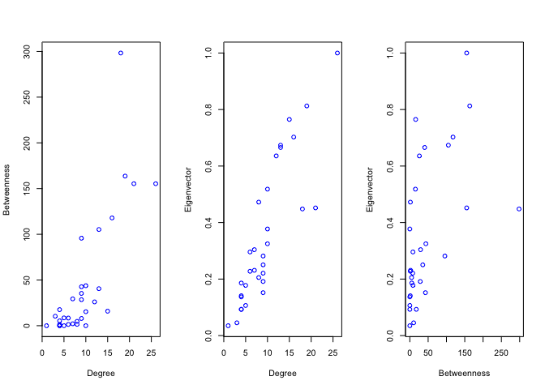<!-- -->

``` r
cor(ev, deg)
cor(ev, betw)

set.seed(1234)
par(mfrow = c(2, 2))
layout <- layout.fruchterman.reingold(g)
plot(g,layout = layout,
     vertex.label=NA,
     edge.arrow.size=0.1,
     main="The Electronic Information Exchange System (EIES)")
plot(g, layout=layout, 
     vertex.label=NA,
     vertex.size=deg*0.75, 
     edge.arrow.size=0.1,
     vertex.label.cex=0.6, main="Degree Centrality")

plot(g, layout=layout,
     vertex.label=NA,
     vertex.size=betw*0.05, 
     edge.arrow.size=0.1,
     vertex.label.cex=0.6, main="Betweenness Centrality")

plot(g, layout=layout,
     vertex.label=NA,
     vertex.size=ev*20, 
     edge.arrow.size=0.1,
     vertex.label.cex=0.6, main="Eigenvector Centrality")
```

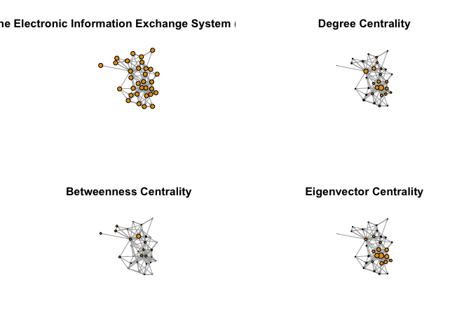<!-- -->
